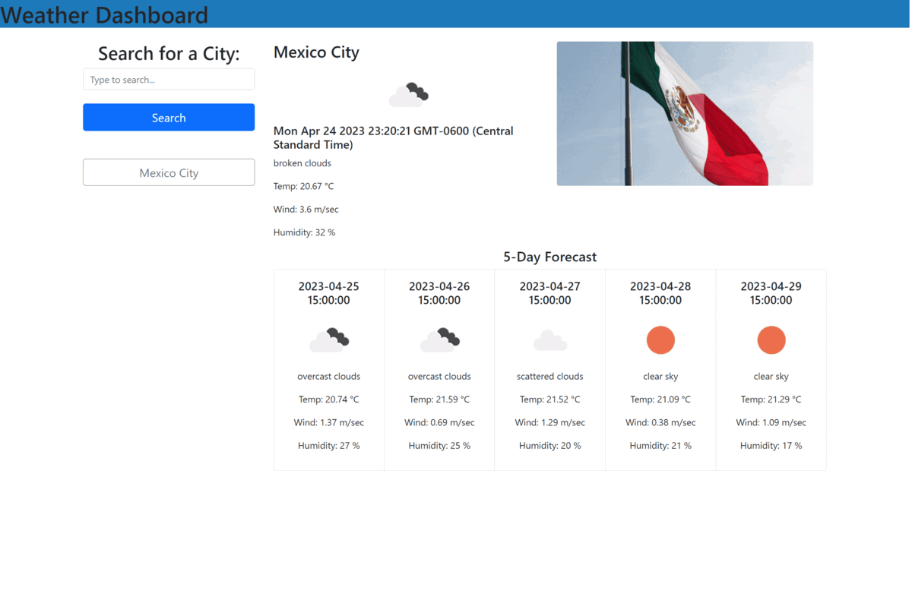

# Module 6 Challenge Weather Dashboard [Web Developer]

## Description

This repository contains challenge 6 for the Web Developer bootcamp, which is a weather dashboard that utilizes the OpenWeatherMap API and Unsplash.com images. The dashboard is designed to display the current weather data and a 5-day forecast for Mexico City automatically at 15:00 hrs, and it also allows users to search for and display weather data for any other city.

## Deployed application 

(https://neto1895.github.io/M6C_Weather_Dashboard-ECR/)

The following image shows the application first look and functionality. The functionallity.

## Usage

To use the weather dashboard, simply type the name of a city into the search bar and click the "search" button. The dashboard will retrieve the current weather data and a 5-day forecast for the specified city and display it on the screen. Additionally, the dashboard will generate a new button for the searched city, allowing you to quickly access its weather data in the future without having to type the city name again. Simply click on the button corresponding to the city you want to view, and the dashboard will display the weather data for that city.

## Installation

N/A

## Credits

This code is made by Ernesto Cruz using the openweather API.

## License

N/A

